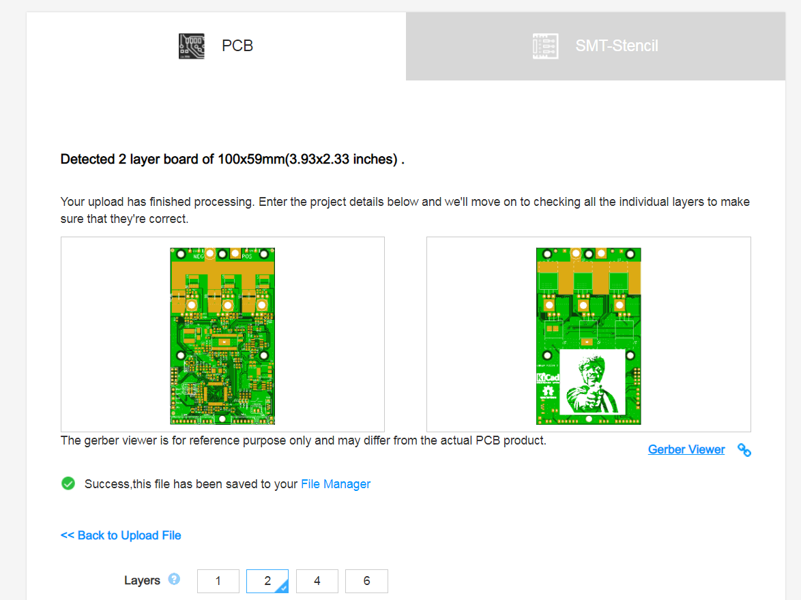
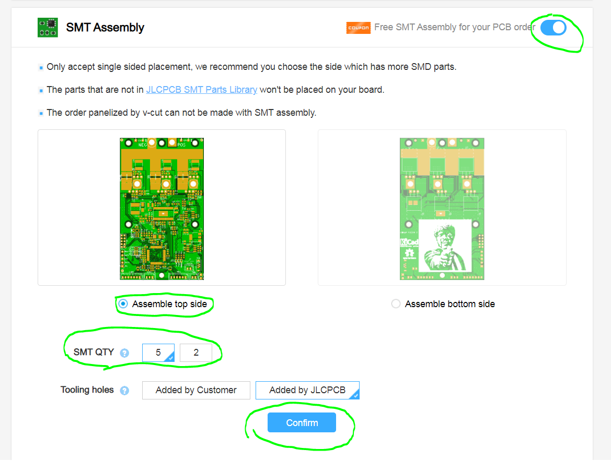
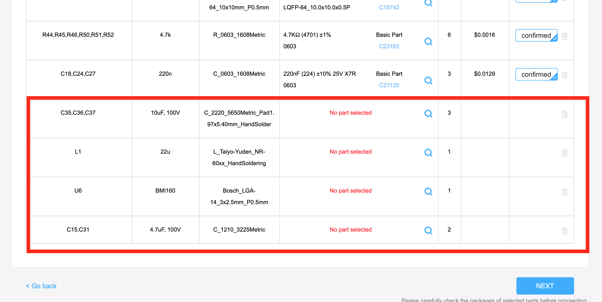
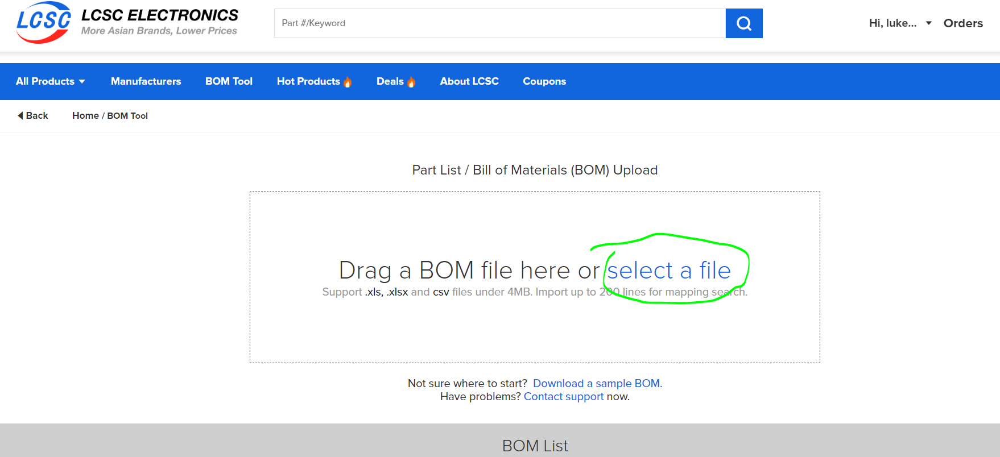
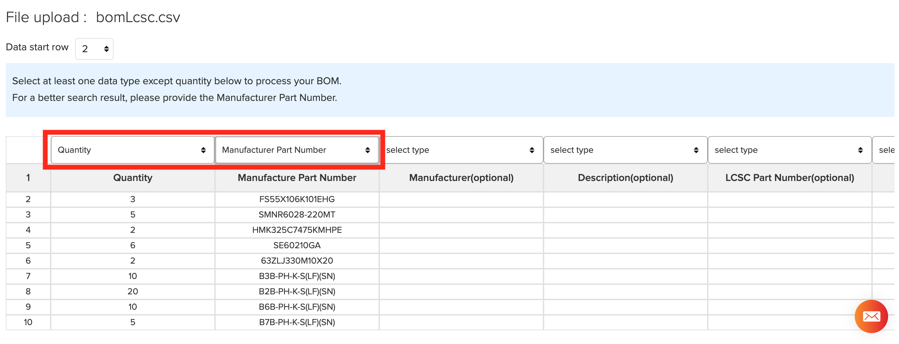
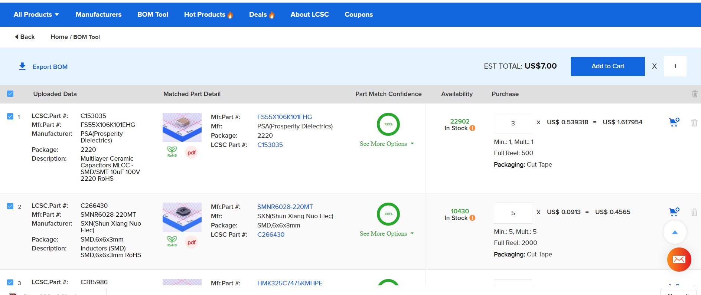

# JLCPCB and LCSC Ordering Guide

## JLCPCB

1. Clone or [download](https://github.com/shamansystems/Cheap-FOCer-2/archive/master.zip) the Cheap FOCer 2 repository and have the files available

1. [Create an account](https://passport.easyeda.com/register) with [JLCPCB.com](http://JLCPCB.com). This account will also carry over to [LCSC.com](http://LCSC.com) since they are the same company.

1. Go to: [https://cart.jlcpcb.com/quote](https://cart.jlcpcb.com/quote)

1. Click the `Add your gerber file` button and select the [gerber.zip](../../gerber.zip) file from the root directory 

1. You should now see the CFOC2 front and back in the preview as shown below 

1. There are a few properties that you can customize if you want. The PCB quantity (the amount you want made), thickness, color, and surface finish are all I recommend adjusting to preference. Note that certain choices of these options will affect pricing. By default, the cheapest options are already selected. 

1. Select the toggle button to enable SMT Assembly 

1. Select the `Assemble top side` option

1. Select how many boards you want assembled with the `SMT QTY` option

1. Select the `confirm` button to continue

1. Add the [bom.csv](../../bom.csv) and [cpl.csv](../../cpl.csv) files in the root directory.  To download from github click the `Raw` button then save as from your browser.  Before saving you may need to change the extension from txt to csv.  

1. Click `Next` to continue

1.
    You will now see the parts selected by JLCPCB based on the BOM that was uploaded. This list of parts includes every possible component available by JLCPCB to be assemble onto the Cheap FOCer 2.

    The `Extended Parts` such as the DRV8301 and the 100v rated components cost more but will be much better if JLCPCB solders it for you.  The DRV8301 chip is one of the hardest things to solder by hand.

    The only parts that you should see as `No part selected` are the (10uF, 100V) caps, the 22uH inductor, the BMI160 IMU, and the (4.7uF, 100V) caps. These components plus the MOSFETs must be acquired and assembled external to JLCPCB. Ordering these remaining components from LCSC.com will be covered [later in this guide](#remaining-components-from-lcsccom).
    

    If you intend to use your FOCer for balancing applications such as a onewheel or unicycle you will have to solder the BMI160 IMU yourself. This is a leadless component which requires a [reflow station](https://www.amazon.com/Flexzion-Digital-Soldering-Station-Desoldering/dp/B0154G4A28).

    If you have components that are **out of stock** or discontinued please see [this note](#out-of-stock-or-discontinued-components) below.

1. Click `Next` to continue

1. You should now see a preview of the parts placement on the CFOC2. The placement of the DRV8301 and a few other multi-pin components will appear wrongly placed. **This is ok.** JLCPCB will correct this later in what they call a `DFM review`. I have had no issues in letting JLCPCB handle the correction of component placement in all of my many orders. 

1.
    Scroll down and you will see a list of `Unselected Parts`. The [LCSC BOM file](../../5XBomLcsc.csv) covered [later in this guide](#remaining-components-from-lcsccom) will fulfill the remaining parts.
    

    If you excluded certain parts on your own or if JLCPCB was out of stock of something, then click the `Download Unselected Parts List` button for a list of what you will need to acquire outside of this guide.

1. Next click `Save to Cart` and proceed through the checkout process. If you’ve made it this far then congratulations! The hardest part is over and we will now proceed to ordering the remaining components from LCSC.com.

## Remaining Components from [LCSC.com](http://lcsc.com)

1. Go to [LCSC's boom tool](https://lcsc.com/bom.html#/upload)

1. Click `select a file` and upload [5XBomLcsc.csv](../5XBomLcsc.csv)

1. There should now be a list that has loaded on your screen. You will need to select the column header the `Quantity` and `Manufacture Part Number` columns from the drop-down menus as shown below.
    

1. Click `Next` to continue.

1. You should now see a page showing the parts that LCSC has chosen to fit the parts described in the BOM that was uploaded. Scroll through the list to verify that all parts are present and accounted for. Notice that certain components, have a minimum order quantities and you will need to update the quantities of these items to meet the minimum requirements
    

1. Quantities of parts in this list are for 5 CFOC2. Please scale up the quantities per amount of CFOC2 PCBs you have ordered from JLCPCB.
1. If this is your first time be sure to order extra parts incase you make a mistake

1. If you have components that are **out of stock** or discontinued please see [this note](#out-of-stock-or-discontinued-components) below.

1. After settling on the quantities you want, please add items to your cart and proceed with the checkout process.

1. Next check out the prerequisites section of the [assembly guide](../Assembly/) to prepare for when your PCB arrives

## Out of Stock or Discontinued Components

Please note that JLCPCB and LCSC will often run out of stock on certain components. There is a chance you may have to find an alternative component with the same footprint and properties. Check [this page](outOfStock.md) to see if there are alternatives listed for your part.  If not, post a github issue of where you found a new part so that others can see and we can update [this page](outOfStock.md).  
