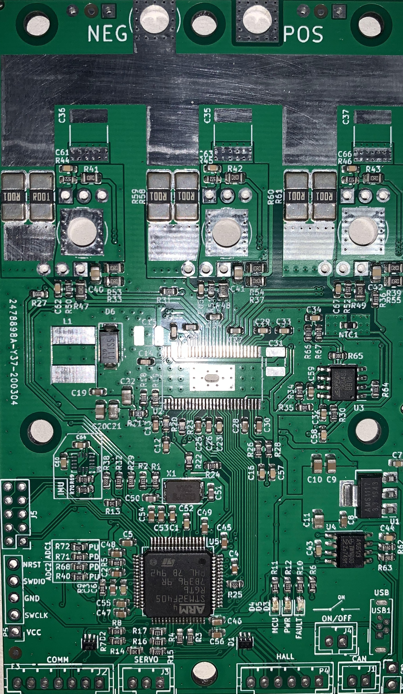
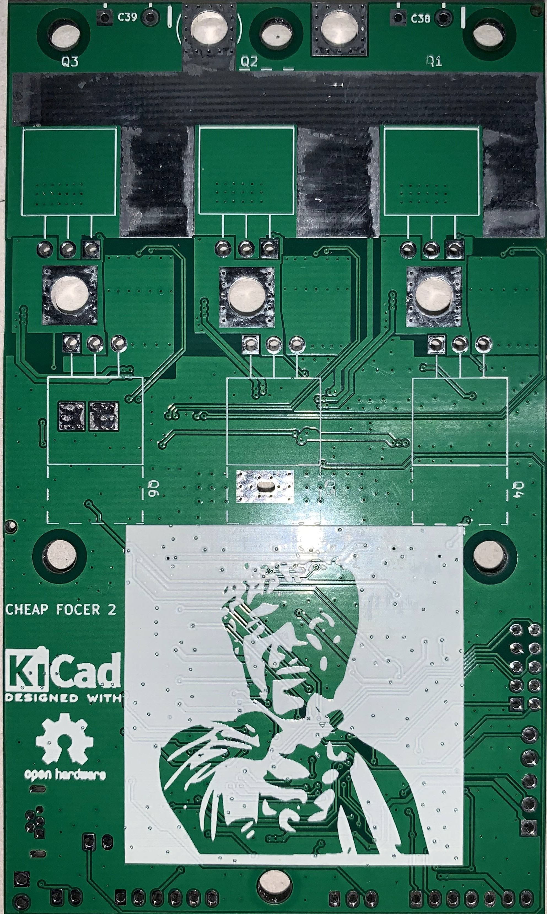
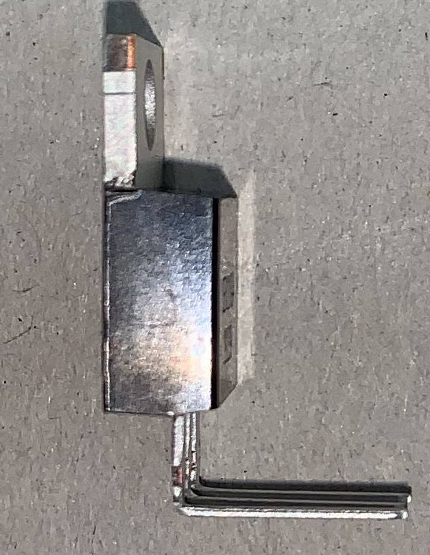
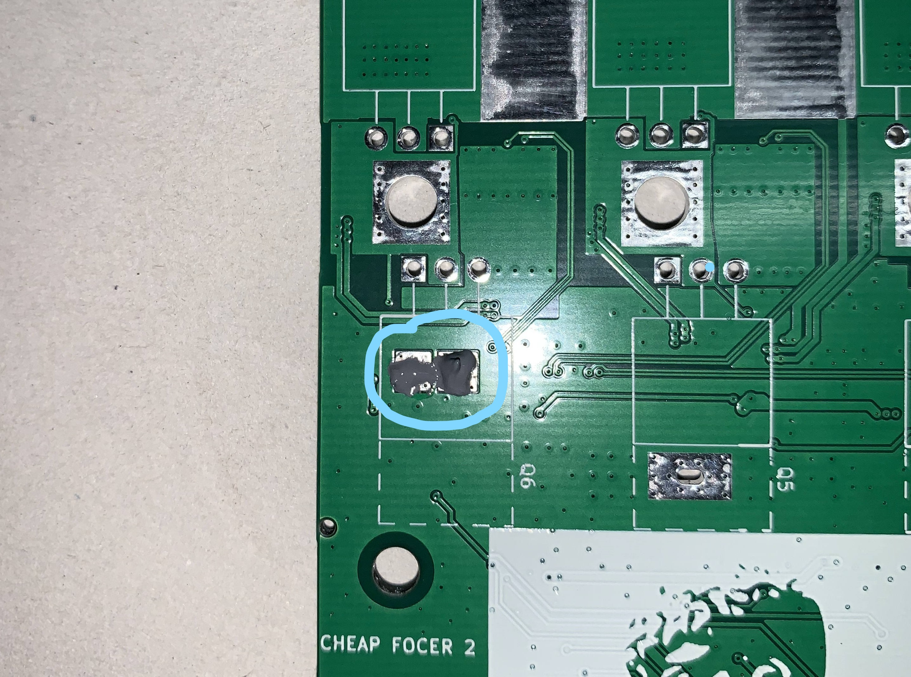
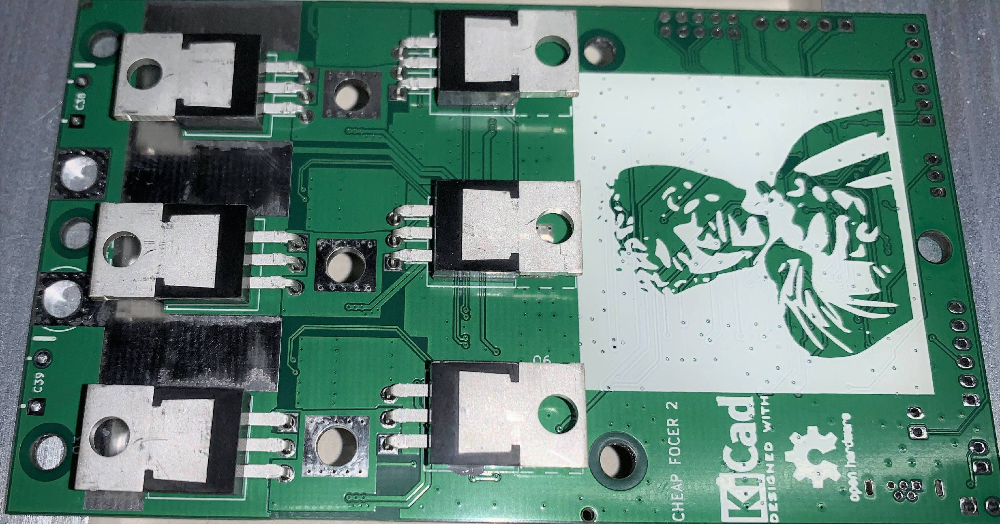
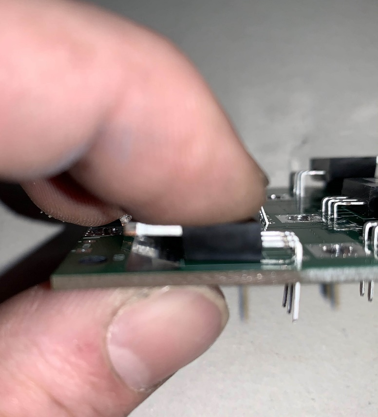
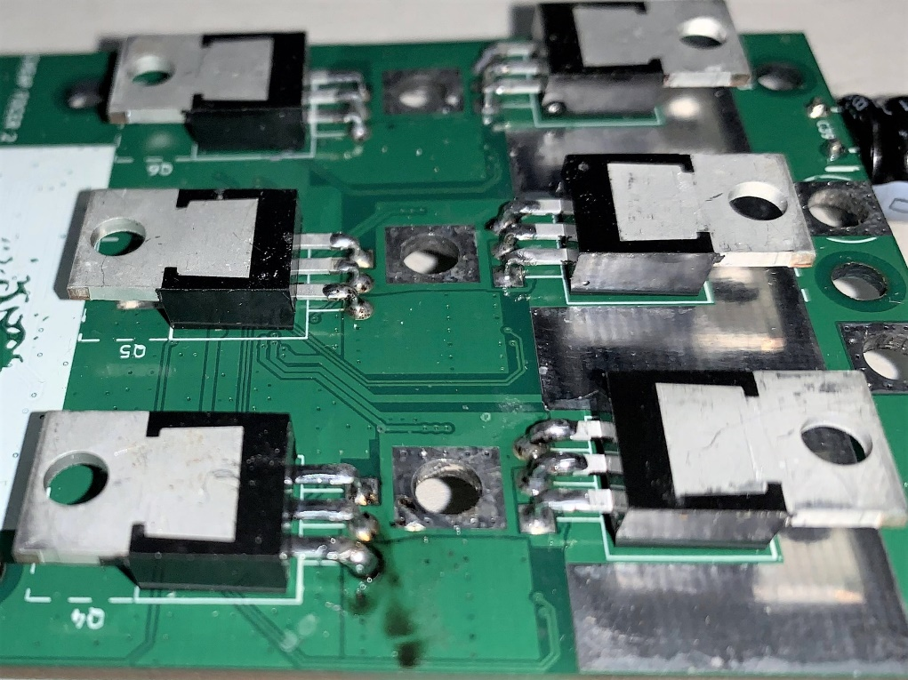
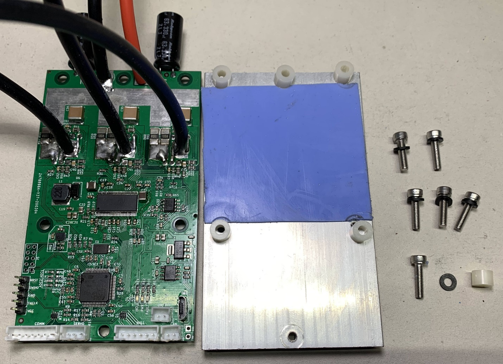
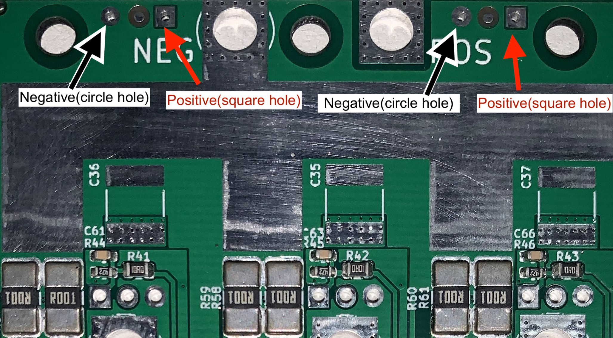

# Assembly Guide

The following guide explains correct procedures on how to assemble the Cheap FOCer 2(CFOC2).  This includes mounting a flat heat sink. Please **pay close attention** to the details in this guide or else risk damaging the controller during assembly or later during operation. **This is not time for "TLDR"**.

## Prerequisites

* Follow the [Ordering Guide](../orderingGuide) and receive mostly SMD assembled PCB
* Obtain all required [Parts](partsList.md)
* Learn how to solder tiny things [reading style](https://www.overclockers.com/how-to-solder-tiny-things/)
or [video style](https://youtu.be/b9FC9fAlfQE)

## What your board should look like

Take a look at the front and back of the SMD assembled images below:
 
 This is what your PCB should look like after the CFOC2 is mostly SMD assembled by JLCPCB.  Note the DRV8301 is absent on the board due to lack of stock. It is recommended that JLCPCB provide and assemble the DRV8301 when possible.  Otherwise, you will have to do something like [this](https://youtu.be/k5N07ByY6Hc?t=399) to put it on.

## Heat Sink

1. Grab your [heat sink and CFOC2 PCB](images/heatSinkAndPCB.jpeg)

1. PCB temporarily fastened to heat sink surface like this:
    

Use a fresh CFOC2 PCB to act as a drill pattern for the mounting holes in your heat sink. Align and temporarily fasten the PCB to the heat sink. The images above are an example of this using the recommended heat sink.

[Drill and tap](https://www.youtube.com/watch?v=LuqliWT1k5A) the 6 mounting holes for M3 screws. I recommend drilling the holes with a 2.5mm drill bit and then tapping the threads. If you do not have a tap and die set, you can *carefully* tap the threads by forcing one of the M3 screws through the holes. Turn the screw slowly and use some oil to help. If done too carelessly, the M3 screw could break off in the hole.  If you have a grinder you can also try [this](https://www.youtube.com/watch?v=7Ewu6VOrgU8)

Figure x. TO-220 MOSFET w/ 90 degree bent legs

Bend all MOSFET legs at a 90-degree angle as shown in the figure above. Bend at the location just before the legs widen. Ideally a tool is used secure the body of the MOSFET and also to bend all the legs at once as per the guidance given in the "Lead Bending" section of [this document](http://www.aosmd.com/res/application_notes/package/AN101_TO220_Guidelines.pdf).

Figure x. Thermal Paste Applied to Exposed Pads

Locate the exposed pads on the backside of the PCB and apply a small amount of thermal paste. This ensures good thermal coupling of the NTC resistor that is responsible for measuring the case temperature of the MOSFETs during operation.

Figure x. MOSFETs Positioned on Back of PCB

Place all MOSFETs in the location and orientation as depicted in figure x above.

Figure x. Correct placement with MOSFET body is flush against PCB.

Figure x. Incorrect placement with MOSFET body not Flush with PCB

It is imperative that all MOSFETs be placed and held flush to the PCB surface. Failure to do so will cause a misalignment with the heat sink surface and cause potentially damage to the PCB.

Figure x. Initial MOSFET solder location

Figure x. Pressure applied to MOSFET

At this time solder the MOSFET legs that go through the square pad as highlighted in figure x. This will tack down the MOSFET into place during the next steps. Do not solder all of the legs yet.

It is advised to apply pressure to the MOSFET in order to ensure it stays flush to the PCB during soldering. Double check all MOSFETs after soldering to verify that the MOSFET bodies are flush to the PCB.

Figure x. MOSFET Legs Bent into Proper Position

Flip PCB over and bend the relevant MOSFET legs into their positions as shown in figure x above. Note that not all legs get bent. Bending the legs like this will add copper to the high-current portions of the PCB which helps handle the current.

Figure x. Legs Soldered from the Top

Solder all legs to their respective locations and pads. Add excess solder to the leg bent toward the larger current sense resistors. This adds conductive material and thermal mass to help handle the high current.

Do not add excess solder to the legs close to the large circular hole. This hole will be where the motor phase cable will be soldered later. Trim excess leg material from legs that were not bent.

Make sure that no solder bridges exist between legs.

Figure x. MOSFET Legs Soldered from Bottom

Flip PCB over and solder MOSFET legs from the bottom side. Soldering from both top and bottom ensures both good conductivity and mechanical security.

It is advised to apply excess solder to the thinner portions of the legs up to the point to where the legs widen. This adds more conductive material to the MOSFET legs where it is needed. Be sure to not create solder bridges between MOSFET legs.

Fully assembled CFOC2 PCB(left) next to prepared heat sink(middle) and fastening hardware(right):

## Solder all remaining components to include cables and the PCB

All [diodes](./images/diodPol.png) should be taken care of by JLCPCB. The only other polarized components are the [electrolytic caps](images/capPol.jpg). The square PCB marking is positive and the circle is for negative as shown below:

If JLCPCB was out of stock for a polarized component please see the silkscreen marking on the PCB in white showing correct orientation for each polarized components as shown below:

If you have any other questions regarding part placement and polarity please open the `Cheap FOCer 2 60mm.pro` file in the design folder with [KiCAD](https://www.kicad-pcb.org/) as shown [here](./images/kiCad.gif)

Be sure to trim excess motor and DC power cable ends on the bottom of the PCB so that there is not risk of the cables being bridged to the heat sink.

Prepare the fastening hardware and a 60mm x 51mm portion of 1mm thick thermal pad as seen in the image above.

Make sure there is not any thermal pad being pinched between the nylon spacers in the heat sink. This will cause a misalignment in spacing which could cause excess stress to the PCB later.

Carefully tighten machine screws in the same manor as tightening lug nuts on a tire. Start with the middle screws on the top and bottom. Tighten until just barely snug and then do the same to the other screws. Do not fully tighten until all screws have had some amount of tightening and there is a relatively even amount of pressure on the PCB from all mounting points. When done, there should be no air gaps in between the nylon spacers and pcb/heat sink and there should be no air gaps between the MOSFET tabs and the thermal pad.

It is now time to power on the controller to conduct a quick test. It is preferable to conduct this initial power up with a current-limited power supply set to 100mA. When powered on, the controller should only draw as much roughly 70mA. If a current-limited power supply is not available, then powering up through an anti-spark connector is second best. The blue LED should illuminate if power is successfully flowing through the controller.

The controller is now ready to be programed. Please follow [this guide](https://electric-skateboard.builders/t/vesc-boot-loader-installation-tutorial/32103?source_topic_id=52813) to install the bootloader and CFOC2 firmware located in the firmware folder of the repository files.
